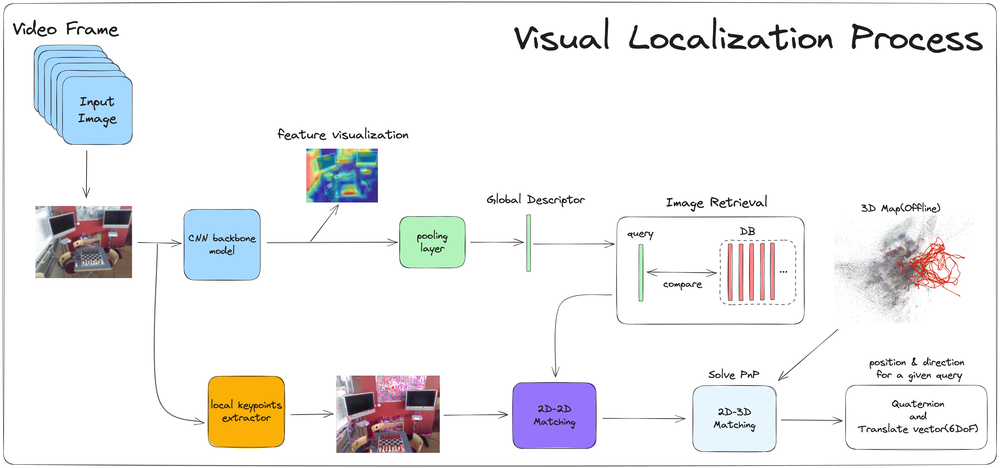
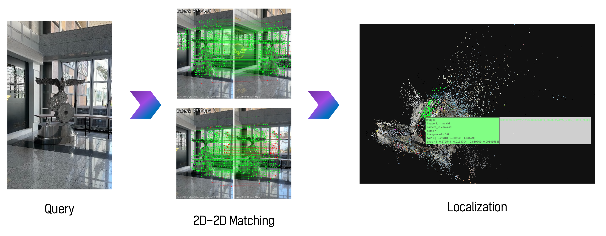

# Visual Localization for Indoor Autonomous Driving System
This repo is our solution in World Creative Robotics Contest 2023, designed by [Minseong Kweon](https://github.com/mnseong), [Sihyeong Park](https://github.com/sihyeong671) 
Try demo! 👉  

## Indoor 3D Map Reconstruction of Mechanical Engineering Office, Pusan National University

    

## Overall Process

    

## Query Localizer Process

    

## 2D-3D Matching for Localization

    

### Reference
**Github** 
We refer [SuperGlue](https://github.com/magicleap/SuperGluePretrainedNetwork), [SuperPoint](https://github.com/rpautrat/SuperPoint) Github Repo  
